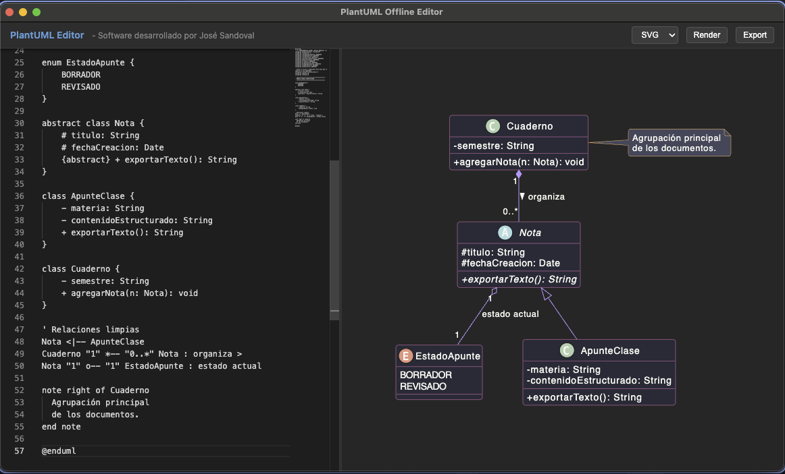

# PlantUML Offline Editor


<p align="center">
  
  <br><i>Ejemplo de la interfaz en modo oscuro renderizando un diagrama de clases POO offline.</i>
</p>

PlantUML Offline Editor es una herramienta minimalista y potente diseñada para diagramar con **PlantUML** de manera 100% desconectada (offline). Esta aplicación no requiere de servidores web externos, ya que incorpora su propia instancia del motor Java de PlantUML de forma autóctona.

## ✨ Características

- **100% Offline**: Renderizado local y privado. Cero dependencias web.
- **Monaco Editor Integrado**: Escribe tu código UML con la misma experiencia visual que ofrece VS Code, junto a una interfaz nativa en modo oscuro.
- **Navegación Pan & Zoom**: Explora diagramas gigantes cómodamente arrastrando el ratón sobre el lienzo oscuro y acercándote/alejándote fluidamente con la rueda del ratón.
- **Renderizado Inmediato**: Visualiza y compila los cambios de tu diagrama al instante.
- **Plantilla POO Definitiva (Dracula Theme)**: Al iniciar un nuevo proyecto vas a encontrarte con una plantilla avanzada (Cheat Sheet) demostrativa con la sintaxis de Programación Orientada a Objetos adaptada bajo un esquema de colores "estilo Dracula" de alto contraste.
- **Exportación**: Guarda tus diagramas generados en formatos `PNG` o `SVG` directamente a tu PC en alta calidad.
- **Motor Distribuible**: Todo el entorno se empaca en bloque gracias a incluir un JRE portátil de Java y `plantuml.jar`. No obligarás a tus usuarios a instalar *GraphViz* ni entornos de Java.

## 🚀 Instalación y Uso (Desarrollo)

Para probar la aplicación en modo desarrollo, simplemente corre:

1. Clona el repositorio:
   ```bash
   git clone https://github.com/jdfesa/electron-plant.git
   ```
2. Instala los módulos de NodeJS:
   ```bash
   cd electron-plant
   npm install
   ```
3. Ejecuta la herramienta:
   ```bash
   npm start
   ```

## 📦 Empaquetado para Producción (Distribución)

Debido a que el **Entorno de Ejecución local de Java (JRE)** depende estrictamente del sistema operativo (Mac, Windows, Linux) y del procesador de cada computadora (Intel, ARM), el proceso de compilación para generar binarios finales para empaquetado de producción requiere unos ligeros pasos de adaptación previos. 

Para mantener la base limpia, hemos documentado rigurosamente este proceso industrial en una sección apartada.

👉 **Por favor, dirígete a nuestra [Guía Oficial de Compilación Multiplataforma (BUILD_GUIDE.md)](BUILD_GUIDE.md) para aprender detalladamente a empaquetar ejecutables para tu sistema en particular.**

## 🛠️ Apéndice de Tecnologías

- **[Electron](https://www.electronjs.org/)**: Framework principal de escritorio.
- **[PlantUML](https://plantuml.com/)**: Interfaz de dibujo compilada en JAR (limitando uso web y Graphviz con motor Smetana).
- **[Monaco Editor](https://microsoft.github.io/monaco-editor/)**: El núcleo ultra-versátil para edición enriquecida.
- **[Eclipse Temurin JRE](https://adoptium.net/)**: Entorno Headless.

---
*Software desarrollado por **José Sandoval***
